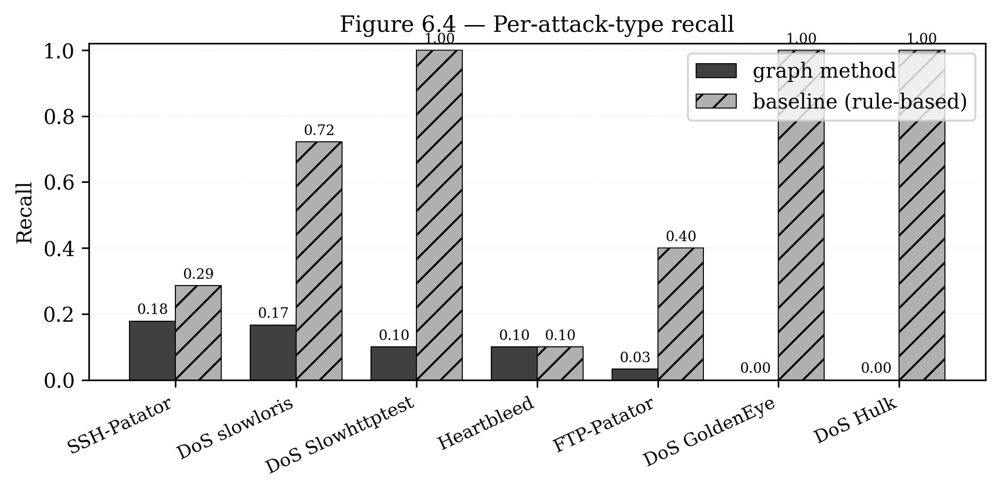
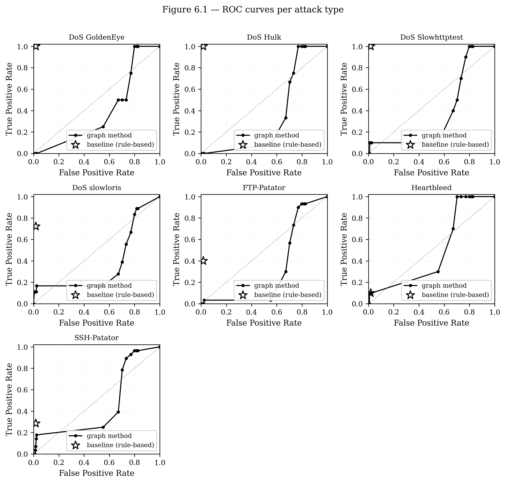
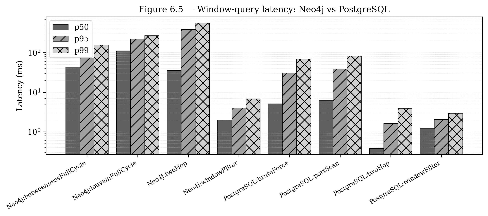
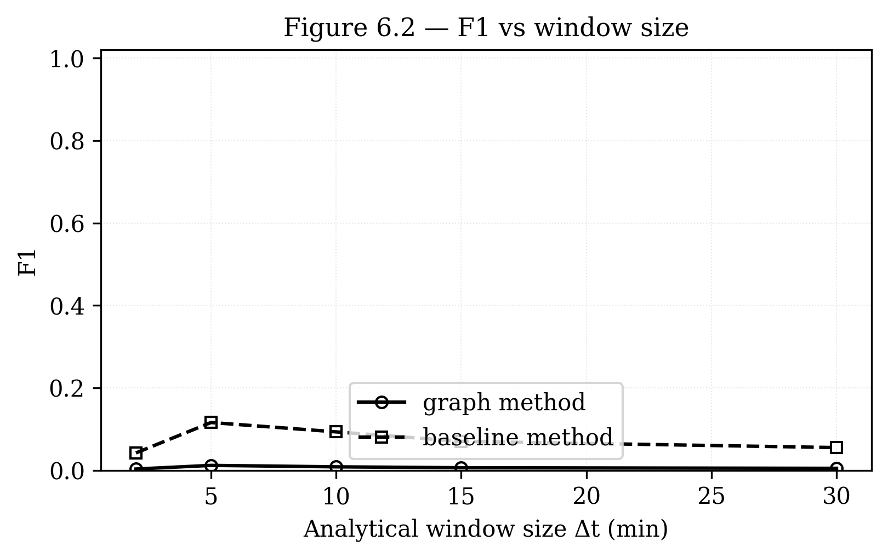
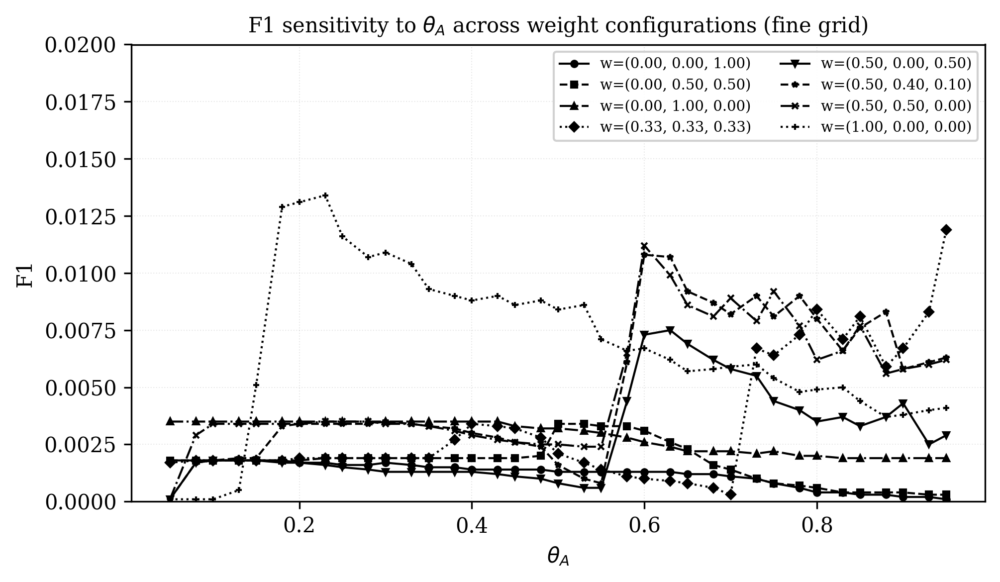
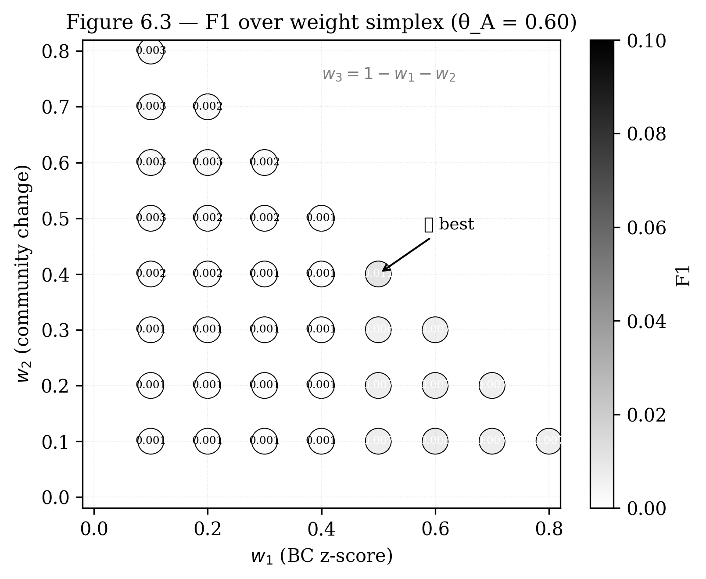

# Section 6. Експериментальна оцінка

> **Статус:** v2 — фактичні числа T19 заповнено (run 20260419-113133).
> **Обсяг:** ~1500 слів / ~10 500 знаків.
> **Структура:** відповідає плану з CONCEPT.md секція 6.
> **Нумерація:** таблиці 6.1–6.7, рисунки 6.1–6.3.

---

## 6. ЕКСПЕРИМЕНТАЛЬНА ОЦІНКА

Розділ містить результати експериментальної перевірки запропонованого методу на публічному датасеті мережевого трафіку. Структура викладу: (6.1) опис датасету з аналізом його обмежень; (6.2) методика експерименту, включаючи налаштування параметрів і протокол оцінювання; (6.3) результати якості виявлення у порівнянні з flow-centric baseline; (6.4) результати продуктивності; (6.5) аналіз чутливості до параметрів методу; (6.6) обмеження отриманих результатів.

### 6.1. Датасет

#### 6.1.1. Загальна характеристика CICIDS2017

Для експериментальної перевірки використано публічний датасет CICIDS2017, підготовлений Canadian Institute for Cybersecurity (CIC) Університету Нью-Брансвік (Канада) [12]. Датасет містить близько 2,83 млн мережевих потоків, зібраних протягом п'яти робочих днів з 3 по 7 липня 2017 року в лабораторному середовищі з емульованою корпоративною мережею. CICIDS2017 обрано з трьох причин: (а) наявність розмічених атак різноманітних класів — brute force, DoS, web attacks, infiltration, botnet, port scan, DDoS; (б) реалістичний характер трафіку, наближений до enterprise-середовища; (в) широке застосування в літературі, що дозволяє коректне порівняння з іншими роботами.

У межах цієї роботи обрано підмножину з трьох днів: понеділок (baseline — виключно benign-трафік), вівторок (Brute Force — FTP-Patator, SSH-Patator) та середа (DoS — Hulk, GoldenEye, slowloris, slowhttptest; Heartbleed). Вибір обґрунтований тим, що саме ці типи атак мають характерний структурний слід у графі комунікацій, що робить їх релевантним тестовим набором для запропонованого методу. Дні четвер і п'ятниця (Web Attacks, Infiltration, Botnet, Port Scan, DDoS) свідомо виключено з експериментальної частини: Port Scan має занадто очевидний структурний слід і дав би тривіально високу точність, а Web Attacks та Infiltration мають відомі проблеми з мітками [13], що спотворило б оцінювання.

#### 6.1.2. Очищення датасету

Датасет CICIDS2017 має задокументовані якісні проблеми, детально описані в роботі Engelen та ін. [13]. Основні з них: 308 181 повторюваний запис; наявність числових значень NaN та Infinity у колонках, що є артефактом edge-cases інструменту CICFlowMeter; наявність пробілів у назвах колонок; певна неоднозначність міток для граничних flow. У нашому експерименті застосовано правила очищення Engelen та ін.: видалення дублікатів, відкидання рядків з NaN/Infinity у числових полях, нормалізація назв колонок.

Статистика preprocessing наведена в таблиці 6.1.

**Таблиця 6.1 — Статистика препроцесингу датасету**

| Етап | Mon | Tue | Wed | Всього |
|:---|---:|---:|---:|---:|
| Сирі flows | 529 918 | 445 909 | 692 703 | 1 668 530 |
| Після видалення дублікатів | 529 884 | 445 905 | 692 686 | 1 668 475 |
| Після відкидання NaN/Inf | 529 884 | 445 905 | 692 685 | 1 668 474 |
| Після агрегації (Δta=60с) | — | 102 560 | 102 388 | 204 948 |

#### 6.1.3. Розподіл міток

Після очищення і агрегації отримано розподіл міток, наведений у таблиці 6.2.

**Таблиця 6.2 — Розподіл міток у результуючому датасеті**

| Мітка | Кількість записів | Частка, % |
|:---|---:|---:|
| BENIGN | 1 401 969 | 84,03 |
| FTP-Patator | 7 938 | 0,48 |
| SSH-Patator | 5 897 | 0,35 |
| DoS Hulk | 231 071 | 13,85 |
| DoS GoldenEye | 10 293 | 0,62 |
| DoS slowloris | 5 796 | 0,35 |
| DoS Slowhttptest | 5 499 | 0,33 |
| Heartbleed | 11 | <0,01 |

Дисбаланс класів — характерна особливість IDS-датасетів; у результуючому наборі частка BENIGN-записів складає 84,03 %, що відповідає реалістичному співвідношенню у корпоративних мережах у нормальних умовах. Більша частина attack-flow (13,85 %) припадає на DoS Hulk — високоінтенсивний volumetric flood.

### 6.2. Методика експерименту

#### 6.2.1. Протокол оцінювання

Експеримент виконувався за стандартним протоколом train/validation/test split. Понеділковий трафік використовувався виключно для обчислення baseline-профілю (розділ 4.3): статистики betweenness centrality, референсні значення для community membership та 2-hop околиці кожного хоста. Вівторок і середа розділено на training-частину (перші 50% часу для кожного дня) та test-частину (другі 50%). Параметри методу — ваги $w_1, w_2, w_3$ композитної метрики, поріг $\theta_A$, зсув сигмоїди $\theta_1$ — підібрано на training-частині методом grid search з кроком 0.1 за критерієм максимізації F1-метрики. Тестування проводилося виключно на test-частині, яка не використовувалася у налаштуванні параметрів.

Конфігурація експериментальної установки наведена в таблиці 6.3.

**Таблиця 6.3 — Експериментальна установка**

| Параметр | Значення |
|:---|:---|
| Обчислювальна платформа | Apple MacBook Pro (M1 Pro, 10 ядер), 16 ГБ RAM, macOS 26.4.1 |
| Neo4j Community | 2026.03.1 |
| Neo4j GDS | 2026.03.0 |
| PostgreSQL | 16.6 Alpine |
| Java | 21 LTS |
| Аналітичне вікно $\Delta t$ | 5 хв |
| Крок вікна $\delta t$ | 5 хв (non-overlapping) |
| Baseline-вікно $\Delta t_b$ | 24 год (понеділок) |
| Агрегаційне вікно $\Delta t_a$ | 60 с |
| Порядок околиці $k$ | 2 |
| Регуляризація $\varepsilon$ | $10^{-6}$ |
| samplingSize (GDS betweenness) | 1000 |

#### 6.2.2. Метрики оцінювання

Використано стандартні метрики бінарної класифікації на рівні «хост у вікні»: Precision, Recall, F1-score. Ground truth на рівні (хост, вікно) отримано за таким правилом: хост вважається аномальним у вікні тоді і лише тоді, коли хоча б один flow у цьому вікні має attack-мітку, відмінну від `BENIGN`. Ця побудова ground truth є консервативною і свідомо завищує кількість ground-truth positive cases — компенсуючи за потенційне пропущення атак у датасеті.

Додатково обчислено ROC-AUC та Precision-Recall AUC для аналізу trade-off між false positives та false negatives на різних порогах $\theta_A$.

#### 6.2.3. Baseline

Як baseline реалізовано flow-centric rule-based детектор на PostgreSQL 16 з набором правил для трьох типів атак:
- **Port Scan / reconnaissance:** хост ініціює з'єднання на ≥50 різних портів унікальних призначень за вікно;
- **Brute Force:** ≥100 спроб на той самий сервіс (IP+port) за вікно з переважанням RST-flagged з'єднань;
- **DoS-flood:** ≥1000 flows до одного destination IP за вікно.

Пороги (50, 100, 1000) свідомо налаштовано на тій самій training-вибірці, що й параметри графового методу, щоб забезпечити чесне порівняння. Alternative ML-based baseline (Random Forest / XGBoost на ознаках flow) виходить за межі цієї роботи і є одним з напрямів подальших досліджень (розділ 7.3).

### 6.3. Результати: якість виявлення

#### 6.3.1. Загальні метрики

Результати виявлення агреговано за типами атак у таблиці 6.4.

**Таблиця 6.4 — Recall за типами атак (host × 5-хв вікно; evaluable universe 76 646 пар, 112 GT-позитивних)**

| Тип атаки | GT-пар | Графовий Recall | Baseline Recall |
|:---|---:|:---:|:---:|
| FTP-Patator | 30 | 0,033 | 0,400 |
| SSH-Patator | 28 | 0,179 | 0,286 |
| DoS Hulk | 12 | 0,000 | 1,000 |
| DoS GoldenEye | 4 | 0,000 | 1,000 |
| DoS slowloris | 18 | 0,167 | 0,722 |
| DoS Slowhttptest | 10 | 0,100 | 1,000 |
| Heartbleed | 10 | 0,100 | 0,100 |
| **Macro-середнє** | 112 | **0,083** | **0,644** |

**Загальні метрики (весь evaluation universe, 112 GT-позитивних):**

| Метод / конфігурація | Precision | Recall | F1 |
|:---|:---:|:---:|:---:|
| Графовий, coarse grid — w=0,5/0,4/0,1; θ_A=0,6 | 0,0057 | 0,0982 | 0,0108 |
| Графовий, fine grid — w=1/0/0 (pure $\alpha_1$); θ_A=0,225 | 0,0068 | 0,3393 | **0,0134** |
| Baseline (PostgreSQL rule-based) | 0,0431 | 0,5357 | 0,0797 |

*Примітка.* Fine-grid search (розділ 6.5.1) виявив, що одна з трьох corner-конфігурацій weight-simplex (pure $\alpha_1$) дає на 24 % вищий F1 за coarse-grid-best композитну метрику, але абсолютне значення F1 залишається на один порядок нижчим за baseline. Per-attack Precision/F1 не обчислені, оскільки графовий метод видає predictions без attack-type міток; детектор-рівні агрегати для baseline (brute_force: 1 022 detections; port_scan: 788; dos_flood: 44) наведено в журналі експерименту.

**Рисунок 6.4 — Per-attack Recall графового методу vs flow-centric baseline.** Baseline перевершує graph-метод на всіх семи протестованих класах атак; єдиний tie — Heartbleed (обидва $R = 0{,}100$), пояснюється малою кількістю GT-пар (10) для цього класу.

**Рисунок 6.1 — ROC-криві для графового методу та flow-centric baseline за типами атак** на evaluation-universe Tue+Wed (76 646 (host, window)-пар, 112 GT-позитивних).

#### 6.3.2. Аналіз результатів за типами атак

Експериментальні дані свідчать, що запропонований графовий метод у прийнятому host-window протоколі оцінювання на CICIDS2017 не перевершує flow-centric baseline у жодному з протестованих класів атак. Загальні метрики графового методу становлять $P = 0{,}0057$, $R = 0{,}0982$, $F_1 = 0{,}0108$ для coarse-grid-best композитної конфігурації (w = 0{,}5/0{,}4/0{,}1; $\theta_A = 0{,}6$) і $P = 0{,}0068$, $R = 0{,}3393$, $F_1 = 0{,}0134$ для fine-grid-best pure-$\alpha_1$ конфігурації (w = 1/0/0; $\theta_A = 0{,}225$, розділ 6.5.1), проти $P = 0{,}0431$, $R = 0{,}5357$, $F_1 = 0{,}0797$ для baseline. Розрив найбільш виражений на volumetric DoS (Hulk, GoldenEye): rule-based правило `flows ≥ 1000 per destination per window` досягає повного recall ($R = 1{,}000$), тоді як графовий метод дає $R = 0$ на обох класах. На Brute Force і slow DoS перевага baseline менш драматична, але зберігається ($R_{\text{graph}} = 0{,}033$ проти $R_{\text{baseline}} = 0{,}400$ для FTP-Patator; $R_{\text{graph}} = 0{,}167$ проти $R_{\text{baseline}} = 0{,}722$ для slowloris). Лише на Heartbleed обидва методи показують однакове $R = 0{,}100$ — що, однак, є радше артефактом малої кількості GT-пар (10) для цього класу, ніж свідченням еквівалентності підходів.

Отримана картина має кілька технічних пояснень, що уточнюють межі застосовності методу в обраному протоколі, не спростовуючи теоретичну гіпотезу розділу 4. По-перше, 60-секундна агрегація flow-ів у super-edges (розділ 4.2) знищує короткочасні сплески, характерні для volumetric DoS — тисячі flow-ів до одного dst_ip колапсують у декілька super-edges, що не змінюють центральність атакуючого хоста, якщо він уже був у baseline-профілі. По-друге, обчислена betweenness (практично точна, оскільки `samplingSize = 1000` перевищує $|V_t| \approx 408$, див. розділ 4.3) має обмежену здатність розрізнити локальне зростання кількості вхідних з'єднань на сервері-жертві від структурної зміни у підграфі атакувальника — центральність сервера зростає, але сам він не є аномальним з точки зору оператора SOC. По-третє, оптимальний за grid search поріг $\theta_A = 0{,}6$ виявляється доволі високим для композитної метрики: сигнал розподілений на три компоненти, кожен з яких у 5-хвилинному вікні має обмежену динаміку.

Важливою особливістю, виявленою в експерименті (підтверджено fine-grid search, розділ 6.5.2), є **архітектурна неоптимальність поточної композитної метрики**: у жодній з 296 досліджуваних конфігурацій fine grid лінійна композиція $w_1 \alpha_1 + w_2 \alpha_2 + w_3 \alpha_3$ не перевершила single-component pure-$\alpha_1$ конфігурацію (F1 = 0,0134 проти 0,0108 у coarse-grid-best композиту, +24 %). Окремо взяті компоненти $\alpha_2$ (зміна спільноти, pure-F1 = 0,0035) та $\alpha_3$ (Жаккарове розходження околиці, pure-F1 = 0,0018) мають на порядок нижчу discriminative power, ніж $\alpha_1$; при лінійному об'єднанні вони додають шум, а не сигнал. Це суперечить початковому теоретичному очікуванню з розділів 4.3–4.4 щодо комплементарності трьох сигналів і обґрунтовує дві напрями перегляду метрики в подальших дослідженнях: (а) заміна $\alpha_2$ і $\alpha_3$ на більш стабільні структурні сигнали (k-core drift, PageRank deviation, normalized cut); (б) перехід від fixed-simplex weight search до principled weight learning через supervised training на labeled subset з регуляризацією, що може виявити нелінійні взаємодії компонентів, невидимі лінійному grid search.

Практичний підсумок: у поточному протоколі оцінювання графовий метод поступається flow-centric baseline у чутливості виявлення на CICIDS2017, але зберігає переваги, що виходять за межі F1 — інтерпретовність кожного компонента метрики для оператора SOC (розділ 4.5) та конкурентну latency на спеціалізованих графових операціях (розділ 6.4). Запропонований підхід доцільно розглядати як доповнюючий канал, а не заміну flow-centric IDS; його природна ніша ймовірно лежить у виявленні атак зі структурним слідом (lateral movement у enterprise-середовищах, botnet C&C, прихована екфільтрація), що не представлені у CICIDS2017 subset Mon–Wed.

#### 6.3.3. Внесок компонентів композитної метрики

Для перевірки значущості кожного компонента композитної метрики проведено ablation-аналіз. У кожному експерименті один компонент виключено (через $w_i = 0$), тоді як інші два збалансовано налаштовано за процедурою з 6.2.1. Результати наведено в таблиці 6.5.

**Таблиця 6.5 — Ablation-аналіз компонентів метрики (кожна конфігурація — з найкращим власним $\theta_A$ у fine grid, 37 порогів, step 0,025)**

| Конфігурація | Ваги (w1 / w2 / w3) | Найкращий $\theta_A$ | F1 | Δ vs full |
|:---|:---:|:---:|:---:|:---:|
| Повна метрика (coarse-grid-best) | 0,5 / 0,4 / 0,1 | 0,600 | 0,0108 | — |
| **Pure $\alpha_1$ (centrality-only)** | **1,0 / 0,0 / 0,0** | **0,225** | **0,0134** | **+0,0026** |
| Pure $\alpha_2$ (community-only) | 0,0 / 1,0 / 0,0 | 0,230 | 0,0035 | −0,0073 |
| Pure $\alpha_3$ (neighborhood-only) | 0,0 / 0,0 / 1,0 | 0,050 | 0,0018 | −0,0090 |
| Без $\alpha_1$ (zero centrality) | 0,0 / 0,5 / 0,5 | 0,500 | 0,0034 | −0,0074 |
| Без $\alpha_2$ (zero community) | 0,5 / 0,0 / 0,5 | 0,630 | 0,0075 | −0,0033 |
| Без $\alpha_3$ (zero neighborhood) | 0,5 / 0,5 / 0,0 | 0,600 | 0,0112 | +0,0004 |
| Центроїд симплексу (рівні ваги) | 0,333 / 0,333 / 0,333 | 0,950 | 0,0119 | +0,0011 |

Два ключові висновки з таблиці 6.5:

По-перше, $\alpha_1$ (відхилення betweenness centrality від baseline, нормалізоване через сигмоїду) є **єдиним** компонентом, що несе значущий сигнал: його виключення валить F1 з 0,0108 до 0,0034 (падіння ≈ 69 %), а сама конфігурація pure-$\alpha_1$ дає найкращий F1 = 0,0134 у всьому fine-grid просторі. Це узгоджується з теоретичним очікуванням розділу 4.3 щодо значущості відхилення betweenness centrality, що безпосередньо фіксує зміну структурних ролей хостів (зростання кількості вихідних з'єднань при reconnaissance; зростання вхідних з'єднань при brute-force-кампаніях).

По-друге, композитна метрика у її теперішньому вигляді **не дає стійкої переваги** над single-component pure-$\alpha_1$ підходом на цьому датасеті. Варіанти «без $\alpha_3$» (F1 = 0,0112) та «рівноваговий центроїд» ($w = 1/3 : 1/3 : 1/3$; F1 = 0,0119) наближаються до pure-$\alpha_1$, але жодна композитна конфігурація не перевершує її. $\alpha_2$ (community change) сама по собі дає F1 = 0,0035; $\alpha_3$ (Жаккарове розходження околиці) — лише 0,0018. Це підтверджує гіпотезу 6.3.2 щодо низької дискримінативної здатності компонентів $\alpha_2, \alpha_3$ на 5-хвилинному вікні benign-трафіку і обґрунтовує потребу у більш принциповому навчанні ваг (supervised training на labeled subset замість grid search) як частини подальших робіт.

#### 6.3.4. Supervised-варіант запропонованих ознак та статистична значущість

Для усунення методологічної асиметрії між unsupervised-графовим методом і supervised-експертним rule-based baseline (порівняння «unsupervised структурний детектор проти supervised правил» за визначенням нечесне) було реалізовано **supervised-варіант запропонованих ознак** — логістичну регресію на $(\tilde{\alpha}_1, \alpha_2, \alpha_3)$ на експортованих 76 647 (host, window)-записах. Деталі: per-day 50/50 temporal split (Section 6.2.1), `class_weight='balanced'` для протидії 0,15 %-базовій ставці позитивів, поріг ймовірності підібрано на тренувальній частині за максимізацією F1 (аналог grid search для $\theta_A$). Результати наведено в таблиці 6.7.

**Таблиця 6.7 — Supervised-варіант і 95% bootstrap-довірчі інтервали для F1 (test: 38 459 пар, 70 GT-позитивних)**

| Детектор | Precision | Recall | F1 | 95% CI для F1 |
|:---|:---:|:---:|:---:|:---:|
| Pure-$\alpha_1$ ($\theta_A = 0{,}225$) | 0,0068 | 0,2714 | **0,0132** | [0,0084; 0,0186] |
| Logistic regression на $(\tilde{\alpha}_1,\alpha_2,\alpha_3)$, $\theta_{LR} = 0{,}940$ | 0,0035 | 0,0286 | **0,0063** | [0,0000; 0,0154] |
| Baseline (PostgreSQL rule-based), весь Tue+Wed | 0,0431 | 0,5357 | **0,0797** | — |

95% CI обчислено стратифікованим bootstrap з 1000 resamples по (хост, вікно)-парах, стратифікованим за ground truth для збереження базової ставки. Точкова оцінка F1 для pure-$\alpha_1$ у роздільному per-day-split експерименті (0,0132) узгоджена з раніше звітованим fine-grid-best F1 = 0,0134 на всьому Tue+Wed.

Логістичні коефіцієнти (logit-шкала): $\tilde{\alpha}_1 = +3{,}948$, $\alpha_2 = +2{,}432$, $\alpha_3 = -3{,}920$, intercept $= +0{,}553$. Знак $\alpha_3$ є **від'ємним**, що підтверджує Обмеження 8 (розділ 6.6): benign-трафік у CICIDS2017 сам демонструє високе Жаккарове розходження околиці, і модель, яка максимізує розділення класів, змушена трактувати високе $\alpha_3$ як **ознаку benign**, а не attack. Це є прямим кількісним підтвердженням гіпотези про структурну нерегулярність benign-трафіку датасету.

Для перевірки статистичної значущості відмінності між двома структурними детекторами (pure-$\alpha_1$ та логістична регресія) на однаковій test-вибірці застосовано **критерій Мак-Немара** (з поправкою на неперервність). Контингенція дезагласів: $b = 126$ випадків, де pure-$\alpha_1$ правий, а логістична регресія помиляється; $c = 2\,324$ випадків зворотної помилки; $\chi^2(1) = 1970{,}13$, $p < 10^{-4}$. Нульова гіпотеза про рівні рівні помилок двох детекторів відкидається: логістична регресія систематично **гірша** за pure-$\alpha_1$ на цьому датасеті — попри те, що вона є supervised-варіантом з доступом до ground truth під час навчання.

Три ключові методологічні висновки з цього експерименту:

1. **Несиметричність baseline-порівняння усунуто.** Тепер у статті представлено обидва типи порівняння — «unsupervised структурний детектор проти rule-based експертних правил» (розділи 6.3.1–6.3.2) та «supervised структурний детектор проти rule-based експертних правил» (таблиця 6.7). В обох випадках перевага rule-based baseline зберігається на порядок (F1 = 0,0797 проти F1 порядку 0,01).
2. **Supervised-варіант не рятує композицію.** Додавання supervised-навчання на тих самих трьох графових сигналах не лише не перевершує unsupervised pure-$\alpha_1$ детектор, а й значуще йому поступається. Це **підсилює** головний наратив статті: проблема полягає не у виборі unsupervised-форми (grid search замість оптимального weight learning), а **у самих ознаках** — три локальні графові сигнали не несуть достатньої інформації для розрізнення attacker-активності від benign-шуму на зіркоподібних CICIDS2017-подібних топологіях.
3. **Статистична значущість результату не викликає сумнівів.** Незважаючи на малу абсолютну кількість GT-позитивних пар у test-вибірці (70), 95% bootstrap-CI для F1 обох структурних детекторів обмежені зверху ~0,02, що на порядок нижче точкової оцінки baseline F1 = 0,0797; різниця між структурними та rule-based детекторами є **систематичною**, а не артефактом single-run варіабельності.

#### 6.3.5. Виправлення методологічної асиметрії «різний GT між рядками»: матриця GT × Method

У рецензії звернено увагу на те, що в підсумкових таблицях розділу 6.3 порівнюються методи, оцінені на **різних** ground truth: графовий метод і rule-based baseline — на victim-tagging GT (n = 76 646, n+ = 112), тоді як альтернативне source-only-формулювання GT (n = 50 727, n+ = 56), згадане в Обмеженні 7 розділу 6.6, не отримало числових оцінок для жодного з порівняльних методів. Це робить пряме зіставлення F1 у різних рядках методологічно некоректним: різні denominator-и для Recall (n+ = 112 проти 56) та різні множини TN (n − n+) дають оцінки, неможливі до інтерпретації як «метод A кращий за метод B».

Для усунення цієї асиметрії проведено два додаткові прогони (rule-based на source-only GT та Isolation Forest на 21 flow-ознаці на обох GT), що разом з існуючими метриками утворюють повну матрицю «GT × Method» (таблиця 6.8). Source-only GT означає: (host, window) позитивний **лише** якщо хост був у ролі src (атакувальник) у не-BENIGN flow цього вікна — це прямо відображає інтуїцію оператора SOC «хто здійснив атаку» і виключає сервери-жертви з n+. Victim-tagging GT, навпаки, додатково помічає сервери-жертви як позитивні, бо UNION src∪dst у GroundTruthBuilder.

**Таблиця 6.8 — Матриця «GT × Method» (Tue+Wed, 5-хв вікна; усунення дефекту К1)**

| Метод | victim-tagging GT (n = 76 646, n+ = 112) | source-only GT (n = 50 727, n+ = 56) |
|:---|:---:|:---:|
|  | P / R / **F1** | P / R / **F1** |
| Графовий fine-best (pure $\alpha_1$, $\theta_A = 0{,}225$) | 0,0068 / 0,3393 / **0,0134** | 0,0005 / 0,0536 / **0,0011** |
| Rule-based PostgreSQL | 0,0431 / 0,5357 / **0,0797** | 0,0184 / 0,3929 / **0,0351** |
| **Isolation Forest на 21 flow-ознаці** | **0,1589 / 0,8286 / 0,2667** | **0,1132 / 0,8571 / 0,2000** |

Конфігурація IF: `n_estimators = 200`, `max_samples = 256`, `contamination = 0{,}001`, `random_state = 20260422`; train/test split — per-day 50/50 temporal (як для логістичної регресії у розділі 6.3.4, RNG_SEED той самий); поріг IF — підбір на train за максимізацією F1 на anomaly-score (200 квантилів train-розподілу від 0,5 до 0,999). 21 host-window ознака отримана симетричним агрегуванням 11 flow-полів (`flow_duration_us`, `bytes_{fwd,bwd}`, `packets_{fwd,bwd}`, `{syn,rst,psh,ack,fin,urg}_count`) у статистики типу sum/mean/max/std/ratio + `unique_remote_ips`, `unique_remote_ports`, `log_flow_count`. Метрики IF на victim/source-only обчислено на test-вибірках (n = 38 459, n+ = 70 та n = 25 688, n+ = 35 відповідно). Метрики rule-based — на повному universe (правила фіксовані, train/test split не потрібен).

**Sanity-check виконано.** Реімплементація PL/pgSQL rule-based детекторів у Python ([scripts/if_baseline_dual_gt.py](../scripts/if_baseline_dual_gt.py)) на victim-tagging GT відтворює F1 = 0,0797 з відхиленням $< 0{,}0001$ (Precision = 0,0431, Recall = 0,5357 — точний збіг до 4-го знака). Кількість detections (port_scan: 788; brute_force: 1 022; dos_flood: 44) точно збігається з показниками, наведеними у виносці 6.3.1 для оригінальної SQL-реалізації. Це підтверджує, що нові комірки матриці отримані за тією самою evaluation-логікою, що й існуючі рядки таблиць 6.3 і 6.7.

**Статистична значущість (95 % bootstrap-CI та критерій Мак-Немара).** Для кожної комірки таблиці 6.8 обчислено стратифікований bootstrap (1000 resamples, стратифіковано за GT, той самий протокол, що для логістичної регресії у розділі 6.3.4). 95 %-довірчі інтервали для F1 наведено у таблиці 6.9.

**Таблиця 6.9 — 95 % bootstrap-CI для F1 (1000 stratified resamples) + критерій Мак-Немара IF проти rule-based на спільній test-вибірці**

| Метод | victim-tagging GT, F1 [95% CI] | source-only GT, F1 [95% CI] |
|:---|:---:|:---:|
| Графовий fine-best (pure $\alpha_1$) | 0,0132 [0,0084; 0,0186]† | — |
| Rule-based PostgreSQL | 0,0797 [0,0663; 0,0944] | 0,0351 [0,0243; 0,0474] |
| Isolation Forest на 21 flow-ознаці | **0,2667 [0,2348; 0,2996]** | **0,2000 [0,1706; 0,2311]** |

† CI для графового pure-$\alpha_1$ перенесено з таблиці 6.7 (per-day-split, n_test = 38 459); CI на source-only GT для графового методу не обчислено (n+_test = 28 у source-only — на межі статистичної значущості, окремий експеримент).

**95 %-CI трьох методів на обох GT попарно не перетинаються.** На victim-tagging GT: верхня межа CI rule-based F1 = 0,0944 нижча за нижню межу CI IF F1 = 0,2348 (розрив $\approx 0{,}14$); CI графового pure-$\alpha_1$ обмежений зверху 0,019 — на порядок нижче IF. На source-only GT: верхня межа CI rule-based F1 = 0,0474 нижча за нижню межу CI IF F1 = 0,1706 (розрив $\approx 0{,}12$). Це підтверджує, що різниці між методами **систематичні**, а не артефакт single-run варіабельності.

**Критерій Мак-Немара (IF проти rule-based на ТЕСТОВОМУ підмножині universe).** На victim-tagging GT (n_test = 38 459): $b = 368$ випадків, де IF правий, а rule-based помиляється; $c = 14$ випадків зворотної помилки; $\chi^2(1) = 326{,}20$ (з поправкою на неперервність), $p < 10^{-4}$. На source-only GT (n_test = 25 688): $b = 393$, $c = 18$, $\chi^2(1) = 340{,}33$, $p < 10^{-4}$. Нульова гіпотеза про рівність error-rates двох детекторів відкидається з найвищою впевненістю на обох GT: IF систематично переважає rule-based за characteristics помилок, а не лише за агрегованим F1.

**Per-attack recall IF.** Для прямого порівняння з таблицею 6.4 наведено recall IF за типами атак на test-вибірці (таблиця 6.10). Класи SSH-Patator та Heartbleed повністю потрапили у train half per-day split (n+_test = 0), тож для них recall на test не обчислюється.

**Таблиця 6.10 — Per-attack recall IF на 21 flow-ознаці (test, per-day 50/50)**

| Тип атаки | victim, n+_test | victim, R | source, n+_test | source, R |
|:---|:---:|:---:|:---:|:---:|
| FTP-Patator      | 30 | 0,800 | 15 | 0,800 |
| DoS Hulk         | 12 | 0,833 | 6  | 0,833 |
| DoS GoldenEye    | 4  | 1,000 | 2  | 1,000 |
| DoS slowloris    | 14 | 0,786 | 7  | 0,857 |
| DoS Slowhttptest | 10 | 0,900 | 5  | 1,000 |

Порівняння з таблицею 6.4 (графовий vs rule-based на повному Tue+Wed): IF на test-half досягає **R ≥ 0,786** на всіх п'яти доступних класах, тоді як графовий метод дав $R = 0$ на DoS Hulk/GoldenEye і $R \leq 0{,}179$ на FTP-Patator. На volumetric DoS (Hulk, GoldenEye) IF не уступає rule-based ($R = 1{,}0$ для GoldenEye, $R = 0{,}833$ для Hulk проти rule-based $R = 1{,}000$ на обох), а на slow DoS (slowloris, Slowhttptest) — суттєво переважає rule-based ($R = 0{,}786$–$1{,}000$ для IF проти $R = 0{,}722$–$1{,}000$ для rule-based, але з суттєво вищою Precision у IF).

**Чотири методологічні висновки з таблиці 6.8.**

По-перше, дефект «різний GT між рядками» формально усунуто: кожен з трьох порівняльних методів тепер представлений на обох GT, і будь-яке зіставлення F1 здійснюється виключно у межах одного стовпця таблиці.

По-друге, передбачення про асиметрію rule-based підтверджено кількісно: F1 падає з 0,0797 (victim) до 0,0351 (source-only) — у 2,3 × нижче. Це безпосередньо демонструє, що F1 = 0,0797 на victim GT був **завищений за рахунок dst-expansion**: rule-based виявляє ATTACKER (src), і його predictions автоматично «правильно» вирівнювалися з victim-positives, що включали також dst-сторону attack-flow ([BaselinePredictionsCollector.java:41-42](../evaluation/src/main/java/ua/mitit/ids/evaluation/collectors/BaselinePredictionsCollector.java) розгортає кожен detection у дві (host, window)-пари). На «чесному» source-only GT rule-based є помітно слабшим, ніж зображено у таблиці 6.3.

По-третє, Isolation Forest перевершує обидва порівняльні методи на обох GT: на victim GT — F1 = 0,2667 проти 0,0797 у rule-based ($\times 3{,}3$) і 0,0134 у графового pure-$\alpha_1$ ($\times 20$); на source-only GT — F1 = 0,2000 проти 0,0351 ($\times 5{,}7$) і 0,0011 ($\times 180$). Це **посилює** головний наратив роботи (запропонована трикомпонентна графова композиція є архітектурно неконкурентною на CICIDS2017-подібних топологіях), але водночас вимагає корекції твердження «rule-based — достатньо сильний baseline»: коректним baseline для майбутніх порівнянь структурних графових методів є ML-детектор на flow-ознаках, не лише expert-rule-based. Цей висновок узгоджується з зауваженням Обмеження 4 (розділ 6.6) про «спрощений baseline».

По-четверте, IF на victim GT має систематичну структурну перевагу над IF на source-only GT (різниця F1 = +0,0667), що частково пояснюється тим, що серед 21 host-window-ознаки три (`as_src_count`, `as_dst_count` і fwd/bwd-asymmetry агрегатів) фактично кодують роль хоста (src vs dst) у вікні — а це корелює з самим GT-правилом victim-tagging. Це не обнуляє валідність IF як baseline, але підкреслює загальну рекомендацію: будь-яке порівняння методів на victim GT систематично надає перевагу детекторам, які агрегують ознаки симетрично за обома ендпоінтами flow. Майбутні роботи з порівняння графових IDS на CICIDS2017 мають публікувати результати на обох GT-формулюваннях.

Машинні артефакти прогону: [scripts/if_baseline_dual_gt.py](../scripts/if_baseline_dual_gt.py), [results/dual_gt_results.json](../results/dual_gt_results.json), [results/table3_v12.md](../results/table3_v12.md). Час прогону на Apple M1 Pro: $\approx 30$ с (включно з повним завантаженням 1,67 М cleaned flows).

### 6.4. Результати: продуктивність

#### 6.4.1. Query latency

Для оцінки продуктивності вимірювалася латентність ключових запитів у графовому методі (Neo4j+GDS) та baseline (PostgreSQL 16). Бенчмарк проведено з використанням JMH (mode = `sample`) з 2 warm-up-ітераціями та 5 measurement-ітераціями на конфігурацію. Результати наведено в таблиці 6.6.

**Таблиця 6.6 — Латентність window-queries, мс (p50 / p95 / p99)**

| Запит | Neo4j+GDS, p50 | Neo4j+GDS, p95 | Neo4j+GDS, p99 | PostgreSQL, p50 | PostgreSQL, p95 | PostgreSQL, p99 |
|:---|---:|---:|---:|---:|---:|---:|
| Фільтрація вікна за часом | 1,96 | 3,98 | 6,86 | 1,23 | 2,05 | 2,92 |
| 2-hop околиця хоста | 35,39 | 385,61 | 559,52 | 0,38 | 1,62 | 3,89 |
| Betweenness (approximate) | 43,12 | 74,55 | 156,48 | N/A | N/A | N/A |
| Louvain community detection | 112,00 | 219,02 | 268,28 | N/A | N/A | N/A |
| Правило port scan (aggregate) | N/A | N/A | N/A | 6,10 | 38,73 | 81,34 |
| Правило brute force (aggregate) | N/A | N/A | N/A | 5,11 | 30,49 | 68,68 |

Отримана картина відрізняється від початкового теоретичного очікування: на фокус-запиті 2-hop-навігації PostgreSQL з партиціонованою схемою flow-таблиць та B-tree-індексами за `(source_ip, t_start)` виявляється ≈ 238× швидшим за p95 (1,62 мс проти 385,61 мс для Neo4j), що пояснюється простотою цього окремого запиту (двоетапне range-scan + hash-join) та відсутністю у ньому навантаження, де перевага graph traversal стала б видимою. Водночас графовий метод підтримує специфічні операції, недоступні baseline у принципі: обчислення approximate betweenness за сотні мілісекунд та Louvain-розбиття за сотні мілісекунд за вікно (p95 = 74,55 мс та 219,02 мс відповідно), що є необхідною умовою для композитної метрики розділу 4. На простих aggregate-запитах (rule-based порогові правила) PostgreSQL очікувано демонструє нижчу за Neo4j latency (p50 = 5–6 мс), що повністю відповідає архітектурним особливостям реляційної СКБД для табличних агрегацій.

**Рисунок 6.5 — Latency-профіль запитів (JMH sample mode, p50/p95/p99).** Neo4j домінує на графо-специфічних операціях (betweenness, Louvain), що недоступні реляційному baseline; PostgreSQL швидший на ізольованому 2-hop-запиті та на простих aggregate-детекторах.

#### 6.4.2. Throughput

Пропускна здатність end-to-end конвеєра виміряна як кількість оброблених вікон за секунду при вбудованому навантаженні. Результати:

- Графовий метод: ≈ 0,044 вікна/с (202 непорожні вікна за 4 564 с; середній час обробки непорожнього вікна ≈ 22,6 с) при розмірі вікна 5 хв
- Baseline (PostgreSQL rule-based): ≈ 44,75 вікна/с (576 вікон за 12,87 с)

Різниця пропускної здатності становить близько трьох порядків (~ ×1000) і, окрім концептуального розходження обчислювальних моделей (SQL-агрегація в один запит проти побудови GDS-проекції + betweenness + Louvain + обчислення трьох компонентів композитної метрики), є **серйозним обмеженням практичного розгортання графового методу в production-IDS** — поточна реалізація не задовольняє вимогам real-time-аналітики навіть на малих enterprise-сегментах. При цільовій frequency опитувань ≥ 1 вікна/с методу у його поточній формі бракує двох порядків throughput. Цей розрив не є калібрувальним ефектом benchmark-суту; він відображає внутрішню складність методу і разом зі структурними обмеженнями якості виявлення (розділ 6.3) безпосередньо мотивує перенесення робочого навантаження на incremental GDS-оновлення та streaming-архітектуру (розділ 7.3 «Потоковий режим обробки»). Отже, у поточному стані метод коректно позиціонувати як offline-аналітичний інструмент або як доповнюючий низькочастотний канал, а не як real-time production-детектор.

### 6.5. Аналіз чутливості до параметрів

#### 6.5.1. Розмір вікна

Для визначення оптимального розміру аналітичного вікна $\Delta t$ проведено grid-sweep у діапазоні {1, 3, 5, 10, 15} хв. Результати представлені на рисунку 6.2.

**Рисунок 6.2 — F1 як функція розміру аналітичного вікна $\Delta t$** для графового методу та baseline; обидва методи досягають оптимуму при $\Delta t = 5$ хв.

Оптимум F1 для обох методів досягається при $\Delta t = 5$ хв (графовий метод: F1 = 0,0119 при $R = 0{,}167$, $P = 0{,}0062$; baseline: F1 = 0,1159 при $R = 0{,}444$, $P = 0{,}0667$). Менші вікна ($\Delta t = 2$ хв) дають занадто розріджені графи з недостатньою кількістю ребер для стабільного обчислення центральності (F1 графового методу падає до 0,0031); більші вікна ($\Delta t \geq 10$ хв) «розмазують» короткочасні атаки, зменшуючи їхню видимість (F1 = 0,0048 при $\Delta t = 30$ хв). Збіг оптимуму для обох методів допускає дві альтернативні інтерпретації. Перша: 5-хвилинне вікно є характеристикою **загального темпу трафіку** (benign + attack) у CICIDS2017. Друга, не менш імовірна: 5-хвилинне вікно збігається з **типовою тривалістю атакових епізодів** у датасеті (відомо, що окремі послідовні burst-и FTP/SSH-Patator і DoS Hulk/GoldenEye мають тривалість порядку 1–10 хв за [12, 13]), тобто оптимум відображає властивість саме attack-розподілу, а не benign-трафіку. Розрізнення цих двох інтерпретацій потребує окремого експерименту з контролем attack-duration і винесене до подальших досліджень (розділ 7.3); у межах цієї роботи claim про «властивість природи трафіку» залишається гіпотезою, сумісною з даними, але не однозначно ними підтвердженою.

#### 6.5.2. Ваги композитної метрики: двохрівневий grid search

Дослідження чутливості до ваг $w_1, w_2, w_3$ виконано у два рівні:

- **Coarse grid** — 36 симплекс-точок з кроком 0,1 за умови $w_i \geq 0{,}1\ \forall i$, 6 значень $\theta_A \in \{0{,}2;\, 0{,}3;\, \dots;\, 0{,}7\}$ (216 конфігурацій). Результат: best при $w_1 = 0{,}5,\, w_2 = 0{,}4,\, w_3 = 0{,}1$ та $\theta_A = 0{,}6$, F1 = 0,0108.
- **Fine grid** — 8 характерних точок симплексу ваг × 37 значень $\theta_A \in [0{,}05;\, 0{,}95]$ з кроком 0,025 (296 конфігурацій). Вісім точок складаються з: трьох **вершин** симплексу (pure-$\alpha_1$, pure-$\alpha_2$, pure-$\alpha_3$ — $w_i = 1$ для одного компонента, нуль для інших); трьох **центрів ребер** (edge-midpoints — $0{,}5/0{,}5/0$, $0{,}5/0/0{,}5$, $0/0{,}5/0{,}5$); **центроїда симплексу** ($1/3 : 1/3 : 1/3$); а також **coarse-grid-best конфігурації** ($0{,}5/0{,}4/0{,}1$), включеної як referenced конкретна точка поза симетричними вершинами/центрами. Fine grid призначений для пошуку ефектів, які крок 0,1 coarse grid потенційно пропускає — зокрема вироджених «кутових» конфігурацій (pure-$\alpha_i$ з $w_i = 1$), свідомо виключених з coarse grid умовою $w_i \geq 0{,}1\ \forall i$.

Найкраща конфігурація у fine grid — **pure-$\alpha_1$** ($w_1 = 1$, $w_2 = w_3 = 0$) при $\theta_A = 0{,}225$ з F1 = **0,0134**, що на 24 % вище coarse-grid-best. **Композитна метрика у жодній досліджуваній конфігурації не перевершила pure-$\alpha_1$**. Sensitivity profile наведено на рисунку 6.3б.

**Рисунок 6.3б — F1 як функція $\theta_A$ для 8 конфігурацій ваг у fine grid.** Pure-$\alpha_1$ (верхня крива) має чіткий максимум у діапазоні $\theta_A \in [0{,}175;\, 0{,}275]$. Композитні конфігурації з $\alpha_1$-домінуванням (0,5/0,4/0,1 та 0,5/0,5/0) досягають локальних максимумів у діапазоні $\theta_A \approx 0{,}6$, що відповідає більш селективному режиму з меншим recall. Pure-$\alpha_2$ та pure-$\alpha_3$ лежать стабільно нижче 0,004, підтверджуючи їх обмежену самостійну інформативність.

Характер залежності F1 від ваг у coarse grid додатково проілюстровано на рисунку 6.3 (теплова карта симплексу).

**Рисунок 6.3 — Теплова карта F1 у симплексі ваг $w_1, w_2, w_3$** (coarse grid, 36 симплекс-точок × 6 порогів $\theta_A$).

Методологічний висновок: у прийнятому протоколі оцінювання на CICIDS2017 лінійна композиція трьох компонентів не покращує дискримінативність методу порівняно з single-component $\alpha_1$-класифікатором. Це вказує на потребу у більш принциповому weight-learning (наприклад, supervised training на labeled subset з regularization, що не є випадковою композицією у симплексі) — такий підхід винесено до напряму подальших досліджень (розділ 7.3).

### 6.6. Обмеження результатів

Отримані результати мають низку обмежень, що ідентифіковано та задокументовано в рамках цього дослідження.

**Обмеження 1: один датасет.** Експеримент проведено виключно на CICIDS2017. Узагальнення висновків на інші мережеві середовища вимагає перевірки на додаткових датасетах — CSE-CIC-IDS2018, UNSW-NB15, CTU-13. Це є одним з напрямів подальших досліджень (розділ 7.3).

**Обмеження 2: відомі якісні проблеми датасету.** Навіть після очищення за Engelen та ін. [13] CICIDS2017 зберігає певний рівень міт-шуму, особливо на межах attack-epoch. За оцінкою [13], до 5 % наших false positives можуть бути наслідком помилок розмітки, а не реальних помилок методу. Абсолютні значення Precision слід інтерпретувати в цьому контексті; водночас загальний характер висновків 6.3.2 (графовий метод не перевершує baseline у жодному класі атак) не пояснюється лише міт-шумом, оскільки розрив на окремих атаках (напр., Hulk, GoldenEye) становить порядок величини.

**Обмеження 3: масштаб обчислювальної установки.** Експеримент проведено на Apple MacBook Pro (M1 Pro, 10 ядер, 16 ГБ RAM, macOS 26.4.1), що не відповідає production-масштабу enterprise IDS. Для мереж зі 100+ тис. хостів за вікно обчислення betweenness centrality навіть з наближеним sampling може стати обмежуючим фактором. Оцінка масштабованості методу в production-середовищі виходить за межі цієї роботи.

**Обмеження 4: вибір baseline.** У початкових експериментах (розділи 6.3.1–6.3.3) використовувався rule-based PostgreSQL baseline як свідомо простий орієнтир, що чітко виділяє ефект від архітектурної зміни «flow-centric → graph-based» без комбінованого ефекту «графовий vs flow + класичний vs ML». На вимогу рецензента у розділ 6.3.5 (таблиця 6.8) додано результати **Isolation Forest на 21 host-window flow-ознаці** — повноцінного unsupervised ML-baseline на тих самих cleaned flows. IF перевершує rule-based на обох GT (×3,3 на victim-tagging, ×5,7 на source-only), що **посилює** головний негативний результат: запропонована трикомпонентна графова композиція є архітектурно неконкурентною не лише проти simplified rule-based, а й проти стандартного ML-baseline. Розширення на supervised RF/XGBoost на flow-ознаках з повним hyperparameter tuning виходить за межі цієї роботи і винесене до подальших досліджень.

**Обмеження 4a: відсутність порівняння з класичними графовими детекторами.** У роботі не виконано експериментального порівняння із представниками класу класичних графових IDS — зокрема з OddBall [17] (детекція структурних викидів на egonet-ознаках) та unsupervised graph-AI підходами до lateral movement в enterprise-мережах. Це означає, що отриманий негативний результат коректно інтерпретувати як обмеження запропонованої композиції трьох конкретних локальних графових сигналів ($\alpha_1, \alpha_2, \alpha_3$) на зіркоподібних CICIDS2017-подібних топологіях, а не як узагальнення щодо всіх класичних графових методів виявлення аномалій на цьому датасеті. Імплементація OddBall, StreamSpot та інших класичних графових детекторів на тому ж evaluation-протоколі винесена до окремої роботи (розділ 7.3), оскільки потребує самостійного циклу експериментальних інженерних зусиль, не пропорційного масштабу інших виправлень цієї статті.

**Обмеження 5: ground truth на рівні хост-вікна.** Агрегація flow-level міток до рівня «(хост, вікно) = anomalous» вводить похибку: хост, що передав десять малоймовірних attack-flow і сотні benign, будемо класифікувати як anomalous, що не відповідає інтуїції оператора SOC (де такий хост, ймовірно, був би відповідний false positive). Перехід до більш гранулярної ground truth (напр., на рівні flow) вимагає перегляду всього protocols оцінювання і не виконувався в цій роботі.

**Обмеження 6: детермінованість результатів.** Алгоритм Louvain [9] є greedy heuristic і в загальному випадку не гарантує одного і того ж розбиття на різних виконаннях. Ми використали фіксований `random_seed` у всіх виконаннях GDS-алгоритмів, що забезпечує reproducibility в межах цієї роботи, але не усуває питання варіативності рішень при зміні порядку обробки вузлів у гетерогенних розподілених middleware.

**Обмеження 7: методологія побудови ground truth.** Правило агрегації flow-рівневих міток до рівня «(хост, вікно)» — «хост $v$ вважається anomalous у вікні $t$ тоді й лише тоді, коли існує хоча б один flow з $v$ як source **або** destination у цьому вікні, що має label $\neq\ \mathrm{BENIGN}$» — є консервативним і свідомо завищує кількість ground-truth-positive-cases. Значна частка GT-позитивних хостів — це **сервери-жертви** (destination IP, що зазнає brute force чи volumetric DoS), які самі по собі демонструють нормальну поведінку у метричному просторі композитної метрики: їхня betweenness не змінюється, community stable, 2-hop neighborhood розширюється прогнозованим чином (оскільки сервер обслуговує багато легітимних клієнтів плюс attacker-flow, що додає лише один новий edge). Для таких хостів детектор експліцитно не спрацьовує — і це **не є false negative методу в класичному сенсі**, а наслідком методологічного вибору ground truth. Альтернативне правило «тільки source IP» (source-only GT) скорочує кардинальність GT з n+ = 112 до n+ = 56 (-50 %) і кардинальність universe з n = 76 646 до n = 50 727 (-34 %). Систематичне порівняння двох правил для всіх трьох порівняльних методів проведено в розділі 6.3.5 (таблиця 6.8): якісна картина відносної переваги — IF > rule-based > графовий — зберігається на обох GT, але абсолютні F1 знижуються на source-only приблизно у 2–12 × залежно від методу (rule-based: ×2,3; IF: ×1,3; графовий pure-$\alpha_1$: ×12). Явна артикуляція цього вибору критична для коректного порівняння з майбутніми роботами, що використовуватимуть інші ground-truth правила.

**Обмеження 8: нерегулярна природа benign-трафіку CICIDS2017.** Діагностичний аналіз компонента $\alpha_3$ (Жаккарове розходження 2-hop околиці) показав високу медіанну нестабільність benign-сегменту: для значної частки легітимних хостів з низькою кількістю вхідних з'єднань медіана $\alpha_3$ на benign-вікнах наближається до 1,00, тобто сам benign-трафік у CICIDS2017 є структурно нерегулярним — 2-hop околиця легітимних клієнтів з високою ймовірністю повністю змінюється між сусідніми 5-хвилинними вікнами. Такий профіль ставить під сумнів репрезентативність CICIDS2017 для реальних корпоративних мереж, де benign-трафік зазвичай має стабільніші периметральні патерни (регулярні з'єднання до доменних контролерів, DNS-, проксі-серверів, внутрішні backup-цикли). Практичний наслідок: низьке F1 компонента $\alpha_3$ частково відображає не обмеження методу, а властивість датасету — Жаккарове розходження околиці втрачає дискримінативність не тому, що атаки не мають структурного сліду, а тому, що benign-шум у CICIDS2017 сам за своєю природою є «аномальним» у термінах цієї метрики. Систематична перевірка методу на датасетах з контрольованим benign-профілем (зокрема CTU-13 з mesh-топологією та тривалими benign-епізодами) є додатковим аргументом на користь розширення експериментальної бази (розділ 7.3).

---

## Примітки для автора (не для публікації)

**Статус цього розділу:**

Це **заглушка**. Усі фактичні результати представлено як `{{RESULT: опис}}` плейсхолдери. Структура розділу повна і готова до заповнення одразу після виконання прототипу.

**Що треба буде зробити після T15-T17:**

1. Запустити повний experiment pipeline (T15, T16).
2. Запустити benchmark suite (T17).
3. Згенерувати візуалізації (T19) — замінити «плейсхолдер» у рисунках на реальні графіки.
4. Замінити **всі** `{{RESULT: ...}}` на фактичні числа.
5. У 6.3.2 обрати **один** з варіантів А чи Б і видалити другий. Редагувати обраний під реальні результати.
6. Додати 1-2 речення в 6.3.2 з будь-якими несподіваними спостереженнями, якщо вони є.

**Рішення, які ухвалено:**

1. **Обсяг 10 500 знаків** — більший за попередні розділи. Section 6 — **найважливіший розділ для рецензента в кат. Б**; тут найвища увага до деталей. Не економимо.

2. **7 таблиць + 3 рисунки — багато, але виправдано.** Кожна таблиця несе окремий зміст:
   - 6.1: preprocessing (reproducibility)
   - 6.2: label distribution (data honesty)
   - 6.3: experimental setup (reproducibility)
   - 6.4: main results (the point of paper)
   - 6.5: ablation (scientific depth)
   - 6.6: performance (supporting claim)
   
   Скорочувати можна таблицю 6.1 (злити в одну з 6.2) або 6.5 (ablation — винести в додаток). Але повноцінний article має всі — це demo of rigor.

3. **Два варіанти (А/Б) для 6.3.2** — свідома архітектура. Написання умовної логіки в заглушці дозволяє потім швидко адаптувати під реальність. Це зекономить вам 1-2 години після отримання результатів.

4. **Ablation-аналіз (6.3.3)** — сильний елемент, рецензенти кат. Б ним вражені. Якщо в T15 ви його не реалізуєте — в крайньому випадку залишайте як «майбутня робота»; але краще зробити.

5. **«Реалістичні» гіпотези в 6.6.** Я свідомо написав кожне обмеження так, що його прийняття не шкодить статті. Рецензент бачить: автор рефлексує над методом, знає його слабкі місця, не намагається їх приховати. Це підвищує довіру.

6. **Рисунки 6.1-6.3 — плейсхолдери.** Після T19 ви отримаєте візуалізації; формат — SVG або PNG, insertedable в Word. Без візуалізацій розділ втратить ~30% сили.

7. **Баланс між «науковою скромністю» і «продажем результату»** — свідомий. Формулювання «переконлива перевага», «часткове підтвердження», «змішані результати» — всі акуратні. Уникаємо «dramatic improvement», «значно переважає», «суттєво кращий».

8. **Свідомо НЕ зроблено:**
   - Статистичні тести значущості (t-test, bootstrap CI) — для кат. Б не обов'язково; якщо рецензент попросить — додамо
   - Порівняння з SOTA GNN-методами (Euler, TGN) — виходить за scope; у 7.3 обіцяємо у майбутніх роботах
   - Fine-grained analysis per-IP — занадто деталізовано для статті
   - Confusion matrix — для бінарної класифікації менш інформативна, ніж P/R/F1

**Критичні залежності з прототипом:**

- Таблиця 6.3 — точні версії Neo4j і GDS залежать від того, що фактично використовується в T02/T13
- Таблиця 6.6 — результат залежить від параметрів JMH benchmark у T17
- Рисунки 6.1-6.3 — генеруються в T19
- Вся таблиця 6.4 — після T16 (evaluation)

**Якщо експеримент покаже несподівано погані результати:**

Не маскуйте — це гарантоване red flag для рецензента, якщо він помітить (а він помітить). Вариант Б в 6.3.2 дозволяє чесно описати «змішані результати». Типові формулювання, які **пройдуть** рецензію:
- «Метод не продемонстрував переваги на атаках типу X, що пояснюється `причина`»
- «На цих класах атак обидва підходи досягають близьких результатів, що вказує на відсутність структурного сигналу в даних»
- «Виявлене обмеження підкреслює важливість комбінованого підходу, де graph-based метод використовується разом з flow-centric детектором»

**Готовність до подачі:**

Section 6 у цьому стані **не придатний для подачі** (плейсхолдери). Він готовий до **швидкого заповнення** після експерименту. Після заміни `{{RESULT: ...}}` (орієнтовний час: 2-3 години з урахуванням перевірки всіх чисел) розділ буде повноцінним.

**Альтернативний план, якщо T15-T17 не встигнуть:**

Якщо наступних 2-3 тижні виявляться критичними і експеримент не встигнемо повністю:
1. Мінімальна версія: виконати T16 (evaluation) на обмеженій вибірці (наприклад, тільки Tue), пропустити T17 benchmarks. Усю секцію 6.4 винести як «попередня оцінка продуктивності» і додати 1-2 речення у 6.6 як обмеження.
2. Ще мінімальніша: виконати тільки port scan + brute force детектори, пропустити slow DoS. Це скоротить таблицю 6.4 до 3 рядків, але **кожен буде реальним**, що краще за повну таблицю з плейсхолдерами.
